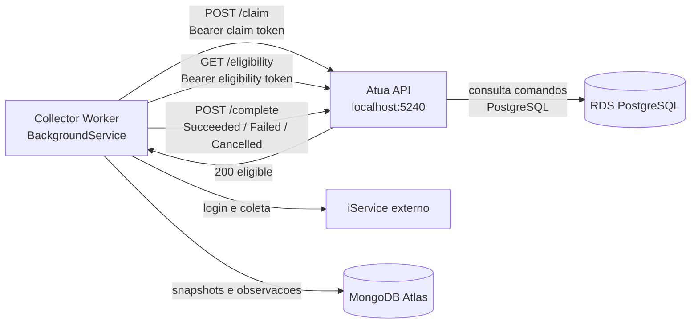
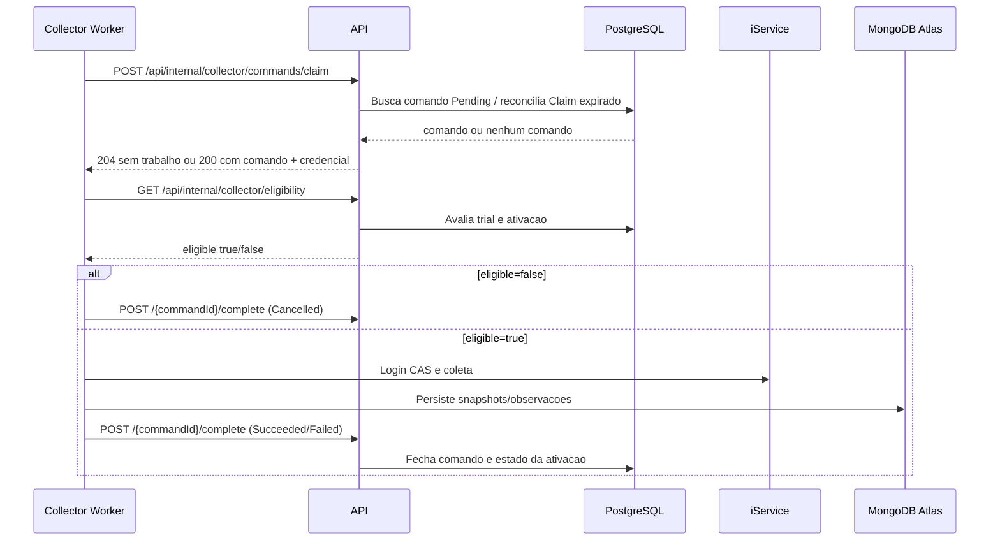

# Estudo do fluxo do Collector

## Resposta curta

A dependencia da API e **intencional e critica para o fluxo de trabalho**, mas o
Collector nao e um servidor HTTP: ele e um `BackgroundService` que faz polling
na API. O erro abaixo significa que o processo tentou chamar
`http://localhost:5240`, mas nao havia nenhum processo escutando nessa porta:

```text
Connection refused (localhost:5240)
```

Isso impede o ciclo atual de `claim`, mas nao prova sozinho que o processo do
Collector morreu. O Worker captura a excecao no ciclo principal, registra o
erro, aguarda `PollingIntervalSeconds` e tenta novamente.

## Topologia local



A connection string do PostgreSQL nao substitui a API. O PostgreSQL guarda o
controle transacional dos comandos; a API aplica autorizacao, tenancy,
elegibilidade, claim atomico e entrega as credenciais do iService ao Collector.
O Collector acessa diretamente o MongoDB para persistir os resultados e, pelo
consumer do ADR-023, le Change Streams para projetar snapshots no PostgreSQL.

## Sequencia normal



## Interpretacao dos resultados

| Sinal | Interpretacao | Consequencia |
|---|---|---|
| `GET /health` retorna `200 {status: healthy}` | API esta viva | Nao garante Collector, Postgres ou Mongo saudaveis |
| `POST /claim` retorna `204` | API viva e fila sem comando disponivel | Comportamento normal; Worker aguarda o polling |
| `POST /claim` retorna `200` | Comando reivindicado | O body contem credenciais em claro; nao compartilhar nem logar |
| `401` ou `403` | Token ausente, invalido ou sem escopo | Conferir os tres service tokens e a credencial no banco |
| `Connection refused` | Nao existe listener no host/porta configurados | Subir API ou corrigir `CollectorWorker__ApiBaseUrl` |
| Timeout | Host alcancavel, mas rota/firewall/listener nao respondeu | Conferir rede, porta, SG e processo da API |
| `POST /complete` retorna `404` | Comando inexistente, expirado ou de outra integracao | Conferir `commandId` e estado do comando |

## Como verificar a saude hoje

O Collector atualmente nao expoe endpoint HTTP proprio. Use as verificacoes
abaixo:

```bash
# 1. API local esta escutando?
curl -i http://localhost:5240/health
lsof -nP -iTCP:5240 -sTCP:LISTEN

# 2. Variavel efetiva do Collector
printenv CollectorWorker__ApiBaseUrl

# 3. O Worker esta vivo e repetindo ciclos?
dotnet run --project apps/collector/Atua.Collector
# Procure por [WORKER] Agente Coletor iniciado.
# e por [CLAIM] Nenhum comando disponivel (204).

# 4. Dependencias de dados
nc -vz atua-postgres-mvp.chaiuimcsv9a.sa-east-1.rds.amazonaws.com 5432
# Para MongoDB, use a URI do MongoDB Atlas configurada em MongoDB__ConnectionString.
```

Um Collector saudavel deve apresentar `Agente Coletor iniciado`, conseguir
repetir `claim` sem `Connection refused`, receber `204` quando nao ha trabalho
ou `200` quando ha comando, e registrar persistencia/`complete` ao concluir uma
coleta. A ausencia de endpoint proprio e uma limitacao atual de observabilidade,
nao um indicio automatico de processo parado.

## Configuracao local

No `appsettings.Development.json`, a chave e `CollectorWorker:ApiBaseUrl`.
A mesma configuracao por ambiente usa:

```bash
export CollectorWorker__ApiBaseUrl=http://localhost:5240
export MongoDB__ConnectionString='...'
export Postgres__ConnectionString='Host=...;Port=5432;Database=atua;Username=...;Password=...;SSL Mode=Require'
```

A API local precisa estar iniciada na porta 5240 antes do Collector. Se a API
estiver em outra porta, ajuste `CollectorWorker__ApiBaseUrl`; nao use
`localhost` quando o Collector estiver dentro de container ou em outra EC2,
porque nesse caso `localhost` aponta para o proprio Collector.

## Colecao Postman

Importe [`collector-study.postman_collection.json`](collector-study.postman_collection.json)
e preencha `baseUrl` e os tres tokens. Execute nesta ordem:

1. `01 - API health`
2. `02 - Collector claim`
3. `03 - Collector eligibility`, somente depois de `claim` retornar `200`
4. `04 - Collector complete`, usando o `commandId` salvo automaticamente

Os scripts pre-request e post-request ficam dentro da colecao e explicam cada
transicao. A resposta de `claim` pode conter credenciais em claro: trate o
console e o historico do Postman como material sensivel.

## Fontes no repositorio

- `apps/collector/Atua.Collector/Worker.cs`: loop e ordem das etapas.
- `apps/collector/Atua.Collector/Api/CollectorApiClient.cs`: chamadas HTTP e tokens.
- `apps/api/Atua.Api/Endpoints/CollectorCommandEndpoints.cs`: contratos de `claim` e `complete`.
- `docs/requirements/RF-009-coleta-inicial.md`: requisito funcional do gate do Collector.
- `docs/decisions/ADR-021-coleta-inicial-credenciais-timeout-e-falha-de-credencial.md`: credenciais, timeout e falhas.
- `docs/decisions/ADR-023-fila-e-consumer-snapshot-para-work-order.md`: MongoDB e consumer PostgreSQL.
